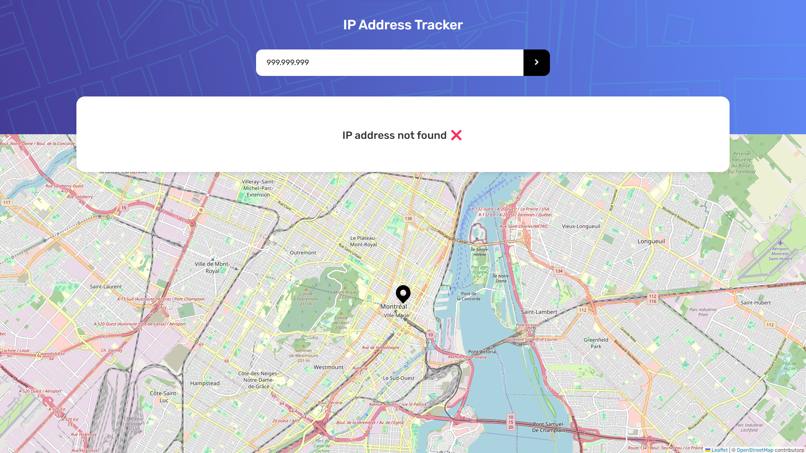

# IP Address Tracker 🔍🌐

## 📌 Table of Contents 

- [Overview](#-overview)
- [Challenge Description](#-challenge-description)
- [Technologies Used](#-technologies-used)
- [What I Learned](#-what-i-learned)
- [Key Takeaways](#-key-takeaways)
- [Project Screenshots](#-project-screenshots)
- [Useful Links](#-useful-links)
- [Contributing](#-contributing)
- [Contact](#-contact)

## 🌐 Overview

This project is a solution to the [IP Address Tracker challenge](https://www.frontendmentor.io/challenges/ip-address-tracker-I8-0yYAH0) from Frontend Mentor. The goal was to create a web application that allows users to track the IP address, location, and other related information based on the input provided.

## 📝 Challenge Description

The challenge included the following tasks:

- Designing and developing a responsive web application that provides accurate information about the provided IP address.
- Fetching data from the [IP Geolocation API by IPify](https://geo.ipify.org/) to obtain location details.
- Implementing a user interface with a search bar to input IP addresses or domain names.
- Displaying the location information, such as city, country, postal code, timezone, and ISP (Internet Service Provider), along with a map showing the approximate location.

## 💻 Technologies Used

- [React](https://reactjs.org/)
- [Styled Components](https://styled-components.com/)
- [React Leaflet](https://react-leaflet.js.org)
- [IP Geolocation API by IPify](https://geo.ipify.org/)

## 🌱 What I Learned

One of the key learnings from this project was integrating external APIs to fetch real-time data and display it dynamically on the web application. Additionally, I gained experience in handling asynchronous operations in React components and managing component states effectively.

## 🚀 Key Takeaways

- Understanding the importance of responsive design for providing a seamless user experience across various devices.
- Implementing user-friendly features such as error handling and loading indicators to improve usability.
- Enhancing the application's functionality by integrating third-party APIs for accessing external data.

## 🖼️ Project Screenshots

### Desktop Screenshots:

### Mobile Screenshots:

## 🔗 Useful Links

- [Live Demo](#) 
- [Project Repository](#)

## 🤝 Contributing

Contributions are welcome! Feel free to open issues or pull requests for any improvements or bug fixes.

## 💬 Contact 

For any inquiries or collaboration opportunities, feel free to reach out via:

(<a href="#ip-address-tracker-">back to top</a>)

